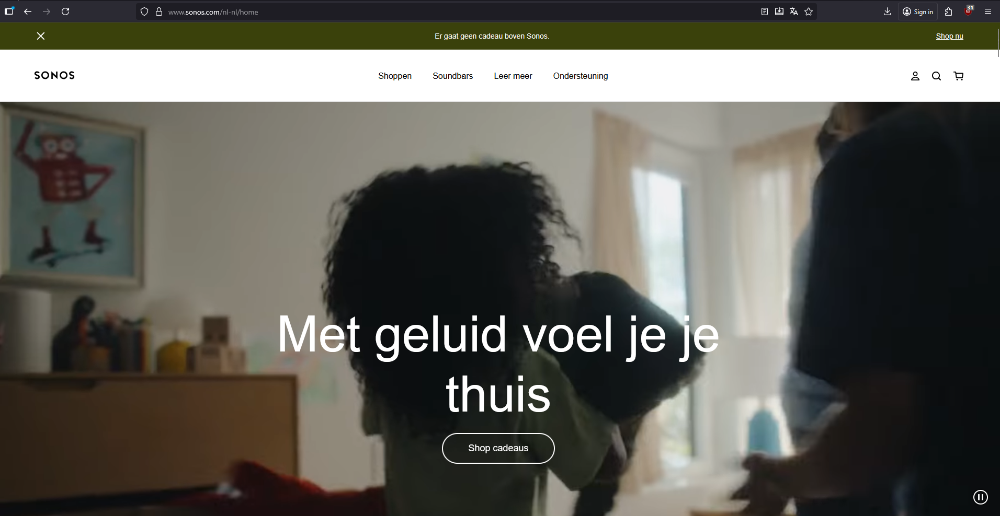
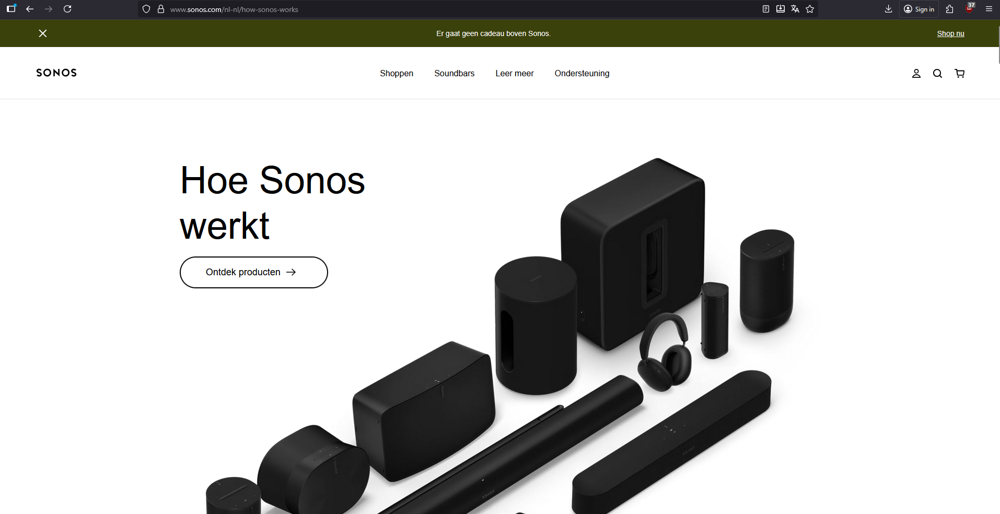

# Procesverslag
Markdown is een simpele manier om HTML te schrijven.  
Markdown cheat cheet: [Hulp bij het schrijven van Markdown](https://github.com/adam-p/markdown-here/wiki/Markdown-Cheatsheet).

Nb. De standaardstructuur en de spartaanse opmaak van de README.md zijn helemaal prima. Het gaat om de inhoud van je procesverslag. Besteedt de tijd voor pracht en praal aan je website.

Nb. Door *open* toe te voegen aan een *details* element kun je deze standaard open zetten. Fijn om dat steeds voor de relevante stuk(ken) te doen.

 # LIVE WEBSITE
 https://tijnhollander.github.io/FED-25-26/

## Jij

  
uitwerken voor kick-off werkgroep

  ### Auteur:
  Tijn Hollander

  #### Je startniveau:
  Ik zit tussen de rode & zwarte piste, ik heb hiervoor de opleiding software development gedaan (en afgerond), echter heb ik al een tijdje niet meer geprogammeerd. 

  #### Je focus:
  Voor nu kies ik responsiveness aangezien ik niet zo goed begrijp wat er bedoeld wordt met surface
 

## Je website

  
uitwerken voor kick-off werkgroep

  ### Je opdracht:
  link naar de website die je gaat namaken óf de naam/omschrijving van je eigen ontwerp
  Ik ga deze website namaken: https://www.sonos.com/nl-nl/home

  #### Screenshot(s) van de eerste pagina (small screen): 
  Home-page Sonos
  

  #### Screenshot(s) van de tweede pagina (small screen):
  Sonos - How sonos works
  https://www.sonos.com/nl-nl/how-sonos-works
  
 

## Toegankelijkheidstest 1/2 (week 1)

  
uitwerken na test in 2e werkgroep

#### Niet goed Narrator
Gelijk zag ik al een foutje namelijk op veel `<a>` links ontbreekt een `aria-label`.  
dit zorgt ervoor dat de narrator alleen de zichtbare linkstekst opleest, wat nu dus: **"Shop cadeaus"** is.  
De gebruiker weet dan niet wat voor cadeaus bedoeld worden of waar de link precies naartoe leidt.  
Dit komt bij bijna alle `<a>` elementen voor sommige zijn natuurlijk wel vanzelfsprekend.

Links in de navbar bevatten ook geen extra context of aria-labels.  
Dit kan ervoor zorgen dat narrators minder kan helpen  duidelijk te maken dat het bijvoorbeeld om onderdelen van de website gaat, zoals *Producten*, *Support* of *Account*.

Op de pagina staan **meerdere `<h1>` koppen**, wat verwarrend kan zijn voor de gebruikers die met sneltoetsen door de koppen navigeren 
Een normale structuur van koppen is (`h1` EENMAAL, `h2`, `h3`). 

Verder worden sommige  **`buttons`**, met iconen (zoals het winkelmandje en het zoekicoontje) niet duidelijk beschreven worden, of ik dat echt gewoon niet kan vinden...  
Narrator leest b.v.d alleen **`button`** voor zonder verdere uitleg.  
Een korte aria-label zoals `aria-label="zoeken"` of `aria-label="winkelwagentje"` zou dit al meteen duidelijker maken

Sommige sections bevatten grote afbeeldingen en videos zonder alternatieve tekst (`alt`).  
hierdoor mist de gebruiker met een screenreader belangrijke context over wat ermee wordt bedoeld.

#### Wel goed Narrator
De links die een aria-label bevatten waren kort en informatief hierdoor begrijp je meteen waar je naartoe geleid wordt.

  ### Bevindingen
  Lijst met je bevindingen die in de test naar voren kwamen:

## Breakdownschets (week 1)

  
uitwerken na afloop 3e werkgroep

  ### de hele pagina: 
  

  ### dynamisch deel (bijv menu): 
  

  ### wellicht nog een dynamisch deel (bijv filter): 
  

## Voortgang 1 (week 2)

  
uitwerken voor 1e voortgang

  ### Stand van zaken
  hier dit ging goed & dit was lastig (neem ook screenshots op van delen van je website en code)

  ### Agenda voor meeting
  samen met je groepje opstellen

  | student 1      | student 2          | student 3    | student 4        |
  | ---            | ---                | ---          | ---              |
  | dit bespreken  | en dit             | en ik dit    | en dan ik dat    |
  | en dat ook nog | dit als er tijd is | nog een punt | dit wil ik zeker |
  | ...            | ...                | ...          | ...              |

  ### Verslag van meeting
  hier na afloop snel de uitkomsten van de meeting vastleggen

  - punt 1
  - punt 2
  - nog een punt
  - ...

## Voortgang 2 (week 3)

  
uitwerken voor 2e voortgang

  ### Stand van zaken
  hier dit ging goed & dit was lastig (neem ook screenshots op van delen van je website en code)

  ### Agenda voor meeting
  samen met je groepje opstellen

  | student 1      | student 2          | student 3    | student 4        |
  | ---            | ---                | ---          | ---              |
  | dit bespreken  | en dit             | en ik dit    | en dan ik dat    |
  | en dat ook nog | dit als er tijd is | nog een punt | dit wil ik zeker |
  | ...            | ...                | ...          | ...              |

  ### Verslag van meeting
  hier na afloop snel de uitkomsten van de meeting vastleggen

  - punt 1
  - punt 2
  - nog een punt
- ...

## Toegankelijkheidstest 2/2 (week 4)

  
uitwerken na test in 9e werkgroep

  ### Bevindingen
  Lijst met je bevindingen die in de test naar voren kwamen (geef ook aan wat er verbeterd is):

## Voortgang 3 (week 4)

  
uitwerken voor 3e voortgang

  ### Stand van zaken
  hier dit ging goed & dit was lastig (neem ook screenshots op van delen van je website en code)

  ### Agenda voor meeting
  samen met je groepje opstellen

  | student 1      | student 2          | student 3    | student 4        |
  | ---            | ---                | ---          | ---              |
  | dit bespreken  | en dit             | en ik dit    | en dan ik dat    |
  | en dat ook nog | dit als er tijd is | nog een punt | dit wil ik zeker |
  | ...            | ...                | ...          | ...              |

  ### Verslag van meeting
  hier na afloop snel de uitkomsten van de meeting vastleggen

  - punt 1
  - punt 2
  - nog een punt
  - ...

## Eindgesprek (week 5)

  
uitwerken voor eindgesprek

  ### Je uitkomst - karakteristiek screenshots:
  

  ### Dit ging goed/Heb ik geleerd: 
  Korte omschrijving met plaatjes

  

  ### Dit was lastig/Is niet gelukt:
  Korte omschrijving met plaatjes

  

## Bronnenlijst

  
continu bijhouden terwijl je werkt

  Nb. Wees specifiek ('css-tricks' als bron is bijv. niet specifiek genoeg). 
  Nb. ChatGpT en andere AI horen er ook bij.
  Nb. Vermeld de bronnen ook in je code.

  1. bron 1 MP3 sonos: https://youtu.be/DwIdo-4jwNk
  2. bron 2  Nav: https://www.w3schools.com/howto/howto_js_mobile_navbar.asp
  3. bron 3 FlexBox: https://css-tricks.com/snippets/css/a-guide-to-flexbox/
  4. Bron 4: Child delay animations: https://stackoverflow.com/questions/8294400/css-animations-with-delay-for-each-child-element
  5. Bron 5: 

